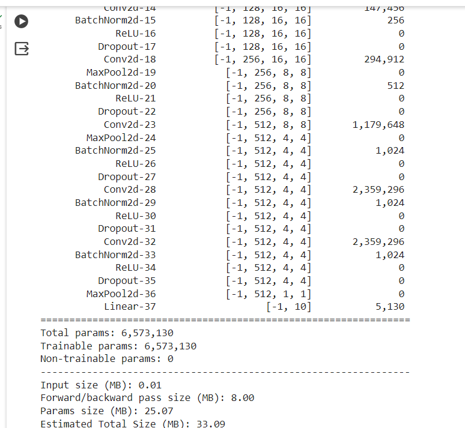
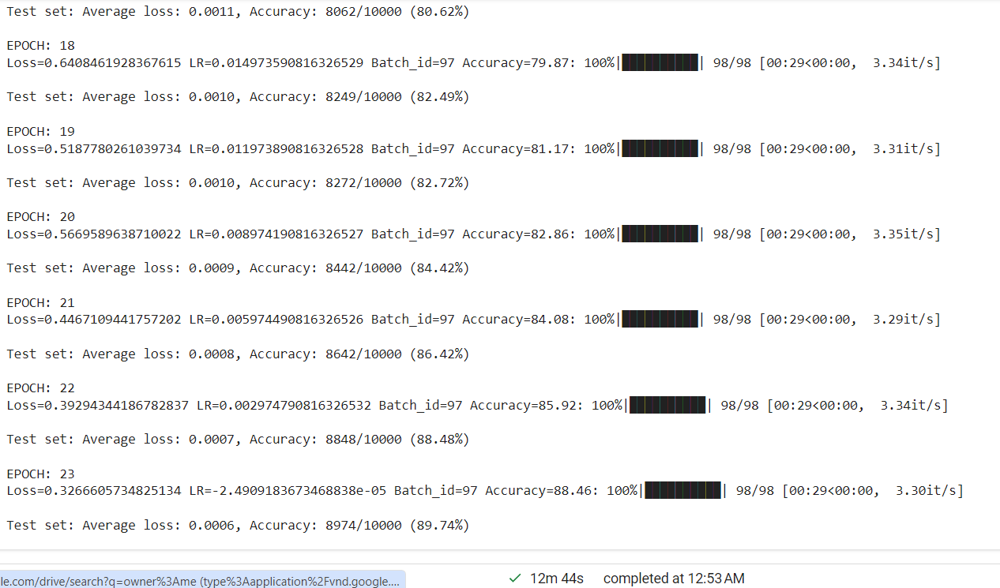

# Assignment 10

# Problem Statement

To train custom RESNET for CIFAR10 dataset

1. For the given architecture instructions
2. using one cycle policy
3. random crop
4. Batch size = 512
5. Use ADAM and CrossEntropyLoss
6. Target Accuracy: 90%

# File Structure

repo contains all the code required during training in different modules
   - custom_resnet.py -> Contains the architecture
   - uitls.py -> contains supportive functions for code
   - main.ipynb -> contains the execution of code 

# Model Parameters

The Model architecture

    

 
# Training Logs

    

       

# Results

  Test Accuracy : 89.74%
  Train Accuracy : 88.48%

